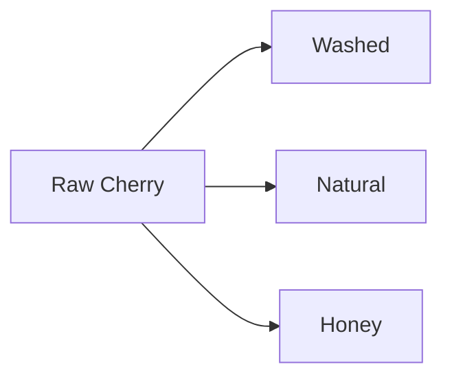

# SYNAPSE - Technical Specification

## Overview

**App name:** Synapse

**Purpose:** Zero-friction handwriting capture overlay for Android stylus devices that transcribes notes via LLM and saves to Obsidian vault.

**Core Flow:**
1. User triggers overlay (floating bubble)
2. Scribbles on transparent fullscreen canvas
3. After 3s inactivity, chunk fades and saves internally
4. User can scribble again (repeat)
5. Tap done → session ends
6. Later: review chunks, select project, sync
7. LLM transcribes → formatted markdown appended to vault file

---

## Architecture

### Tech Stack

| Component | Choice |
|-----------|--------|
| Language | Kotlin |
| UI Framework | Jetpack Compose |
| Min SDK | API 26 (Android 8.0) |
| Target SDK | API 34 |
| DI | Koin |
| State Management | ViewModel + StateFlow |
| Image Format | WebP 85% |
| Storage Access | SAF (Storage Access Framework) |

### Module Structure

Single module architecture:

```
app/
├── src/main/
│   ├── java/com/synapse/
│   │   ├── ui/
│   │   │   ├── overlay/        # Overlay composables, canvas
│   │   │   ├── review/         # Review screen
│   │   │   ├── settings/       # Settings screen
│   │   │   ├── onboarding/     # Onboarding flow
│   │   │   └── components/     # Shared UI components
│   │   ├── service/
│   │   │   └── OverlayService.kt
│   │   ├── data/
│   │   │   ├── repository/     # ChunkRepository, ProjectRepository
│   │   │   ├── storage/        # File operations
│   │   │   └── preferences/    # DataStore preferences
│   │   ├── api/
│   │   │   ├── LlmService.kt           # Interface
│   │   │   ├── GeminiService.kt
│   │   │   ├── ClaudeService.kt
│   │   │   ├── OpenAiService.kt
│   │   │   └── OllamaService.kt
│   │   ├── model/              # Data classes
│   │   └── util/               # Helpers
│   ├── res/
│   └── AndroidManifest.xml
├── build.gradle.kts
```

### ViewModels

| ViewModel | Responsibility |
|-----------|----------------|
| `CaptureViewModel` | Overlay state, active chunks, session timer |
| `ReviewViewModel` | Pending sessions, sync status, project selection |
| `SettingsViewModel` | Preferences read/write |

Shared state (pending chunks, projects) lives in repository layer.

---

## Core Features

### 1. Overlay System

#### Trigger
- **v1:** Floating bubble (draggable, always on top)
- **v2:** Samsung S Pen Air Command integration

#### Floating Bubble
- Small circular button, user-positionable
- Tap → fullscreen transparent overlay appears
- Shows current capture count badge when chunks pending

#### Overlay Canvas
- Fullscreen transparent canvas
- Content behind remains visible
- User scribbles anywhere with stylus
- Fixed pen color (white with dark outline for visibility)
- Fixed stroke width
- Undo: last stroke only

#### Floating Toolbar (during capture)
- Small, draggable
- Buttons: `[✓ Done]` `[↶ Undo]` `[✕ Discard]`
- Semi-transparent background

### 2. Chunk Capture

#### Timeout Behavior
1. User scribbles
2. Pen lifts → 3s timer starts
3. Pen touches → timer resets
4. Timer expires → current strokes saved as chunk
5. Fade animation (0.3s)
6. Canvas clears, ready for next scribble

#### Chunk Storage
- Each chunk saved as WebP 85% to app cache
- Filename: `session_{timestamp}_chunk_{index}.webp`
- Metadata stored alongside: timestamp (seconds since session start)

#### Atomic Writes (corruption prevention)
1. Write to temp file: `chunk_5.tmp`
2. Verify valid image (read header)
3. Rename to `chunk_5.webp`
4. Pre-flight: check storage >50MB free

#### Session End
- User taps ✓ Done → session ends
- OR 15min no input → auto-end with notification

### 3. Review Screen

#### Layout
```
┌─────────────────────────────┐
│ [Stitched ↔ Separate]       │
├─────────────────────────────┤
│                             │
│   Session 14:32             │
│   ┌─────────────────────┐   │
│   │ (chunk thumbnails)  │   │
│   └─────────────────────┘   │
│                             │
│   Session 15:10             │
│   ┌─────────────────────┐   │
│   │ (chunk thumbnails)  │   │
│   └─────────────────────┘   │
│                             │
├─────────────────────────────┤
│ Project: [CHAIDLA      ▼]   │
│ File:    [quick-notes.md ]  │
├─────────────────────────────┤
│         [Sync All]          │
└─────────────────────────────┘
```

#### View Modes (toggle)

**Stitched View:**
- Sessions grouped
- Chunks shown as combined preview

**Separate View:**
- Individual chunk thumbnails
- Checkbox per chunk
- Can delete individual chunks
- Timestamp offset shown (+0s, +4s, +12s)

#### Memory Management
- Thumbnails: downsampled for display
- Full bitmap loaded only on tap-to-preview or sync
- Recycle bitmaps after use

### 4. Project Configuration

#### Setup
1. User picks vault root via SAF folder picker
2. App stores URI with persistent permission
3. User manually adds projects:
   - "Add project" → browse to subfolder → name it
   - Repeat per project

#### Per-Project Settings
| Field | Description |
|-------|-------------|
| Name | Display name |
| Path | Folder URI |
| Default file | e.g., `quick-notes.md` |
| Last used file | Remembered between syncs |

#### Sync Target
- Project dropdown (prefilled with last used)
- Filename field (prefilled with last used, editable)
- Append to existing file

---

## LLM Integration

### Provider Abstraction

```kotlin
interface TranscriptionService {
    suspend fun transcribe(
        chunks: List<ChunkData>,
        cleanupEnabled: Boolean,
        advancedFormatting: Boolean
    ): TranscriptionResult
}

data class ChunkData(
    val image: ByteArray,
    val timestampSeconds: Float
)

data class TranscriptionResult(
    val notes: List<Note>,
    val failedChunks: List<Int>
)

data class Note(
    val text: String,
    val chunksUsed: List<Int>
)
```

### Supported Providers

| Provider | Model | Notes |
|----------|-------|-------|
| Gemini | gemini-1.5-flash | Free tier: 15 RPM, 1500/day |
| Claude | claude-3-haiku | Requires API key |
| OpenAI | gpt-4o-mini | Requires API key |
| Ollama | llava (local) | No API key, runs locally |

### Prompt Template

Default (user-editable in settings):

```
You transcribe handwritten notes to structured JSON.

Input: Image chunks with timestamps (seconds since session start).

Variables:
- CLEANUP_MODE: {cleanup_enabled}
- ADVANCED_FORMATTING: {advanced_formatting}

Phase 1 - Transcribe:
- Read each chunk's handwritten text
- Illegible: "[unclear: best guess?]"
- Diagrams/arrows: see Phase 3
- Empty/accidental marks: skip
- Ignore crossed-out words
- Preserve [[wikilinks]] if user draws brackets

Phase 2 - Group:
- Review all transcriptions
- Group chunks that form one logical thought/topic
- Separate chunks that are distinct ideas

Phase 3 - Format:
- Format each note for readability using markdown
- Use headings, lists, bold where appropriate
- Don't over-format simple notes
- If ADVANCED_FORMATTING enabled:
  - Diagrams/flowcharts: convert to Mermaid syntax
  - Math/equations: convert to LaTeX ($...$)
  - Tables: convert to markdown tables
- If ADVANCED_FORMATTING disabled:
  - Diagrams: "[diagram: brief description]"
  - Equations: "[equation: description]"

Cleanup (if enabled): Fix spelling/grammar, expand abbreviations (w/ → with, b/c → because).

Output ONLY valid JSON, no markdown fencing:
{
  "notes": [
    {
      "text": "formatted markdown content",
      "chunks_used": [0, 1]
    }
  ]
}
```

### Batching Strategy

Dynamic based on total image size:
- Calculate total chunk size
- If exceeds ~10MB, split into batches
- Process batches sequentially
- Merge results

### Rate Limiting

**Setting:** Rate limit handling (Safe / Fast)

**Safe (default):**
- Track request timestamps
- Space out requests to stay under limit
- Slower but never fails

**Fast:**
- Full speed requests
- If rate limited: pause with countdown, auto-retry

---

## Error Handling

### API Failure Mid-Batch

**Partial success strategy:**
1. Chunks 1-3 succeed, chunk 4 fails
2. Save successful transcriptions to vault
3. Keep failed chunks (4-5) in review screen
4. Show: "3/5 synced, 2 failed - Retry?"

### Offline Mode

**Queue for later:**
1. User taps sync, no network
2. Show: "Queued. Will sync when online."
3. App monitors connectivity
4. Auto-syncs when network available
5. Notification: "Sync complete"

### Corrupted Chunks

- Show in review as greyed thumbnail with warning icon
- User can delete manually
- Not included in sync

---

## Settings

### All Settings

| Setting | Default | Range/Options | Category |
|---------|---------|---------------|----------|
| Chunk timeout | 3s | 1-10s | Capture |
| Fade animation | 0.3s | 0-1s | Capture |
| Session auto-end | 15min | 5-60min | Capture |
| Review mode | Stitched | Stitched / Separate | Review |
| Cleanup mode | On | On / Off | LLM |
| Advanced formatting | On | On / Off | LLM |
| Rate limit handling | Safe | Safe / Fast | LLM |
| LLM provider | Gemini | Gemini / Claude / OpenAI / Ollama | LLM |
| API key | - | text | LLM |
| Prompt template | (default) | text editor | LLM |
| Vault path | - | folder picker | Vault |

### Settings Screen Layout

```
┌─────────────────────────────┐
│ ⚙️ Settings                  │
├─────────────────────────────┤
│                             │
│ CAPTURE                     │
│ Chunk timeout         [3s]  │
│ Fade animation      [0.3s]  │
│ Session auto-end    [15m]   │
│                             │
│ REVIEW                      │
│ Default view    [Stitched]  │
│                             │
│ TRANSCRIPTION               │
│ LLM Provider     [Gemini]   │
│ API Key          [••••••]   │
│ Cleanup mode          [ON]  │
│ Advanced formatting   [ON]  │
│ Rate limiting      [Safe]   │
│ Edit prompt template    →   │
│                             │
│ VAULT                       │
│ Vault location    [/Obs..]  │
│ Manage projects         →   │
│                             │
│ ABOUT                       │
│ How to use              →   │
│ Version             1.0.0   │
│ Source code             →   │
│                             │
└─────────────────────────────┘
```

---

## Android Specifics

### Permissions

| Permission | Purpose | Grant Method |
|------------|---------|--------------|
| `SYSTEM_ALERT_WINDOW` | Overlay | System settings (manual) |
| `FOREGROUND_SERVICE` | Keep service alive | Auto-granted |
| `POST_NOTIFICATIONS` | Service notification, sync status | Runtime prompt |
| SAF URI permission | Vault access | Folder picker |

### Foreground Service

- Required for overlay persistence
- Notification channel: `IMPORTANCE_MIN` (minimal visibility)
- User can manually hide via long-press
- Notification text: "Synapse active" with tap-to-open

### Battery Optimization

- Don't request whitelist on first launch
- Detect if app killed unexpectedly
- If killed: next launch prompts user to whitelist
- Only bothers users who have the problem

### App Killed Mid-Session

- Chunks persist to disk immediately on capture
- App restart → detects pending chunks
- Shows in review screen
- Session can continue or sync existing

---

## Onboarding Flow

### First Launch

```
┌─────────────────────────────┐
│                             │
│    Welcome to Synapse        │
│                             │
│  Capture handwritten notes  │
│  without leaving your app   │
│                             │
│        [Get Started]        │
│                             │
└─────────────────────────────┘
           ↓
┌─────────────────────────────┐
│                             │
│  Overlay Permission          │
│                             │
│  Synapse needs to draw      │
│  over other apps to capture │
│  your notes.                │
│                             │
│  [Grant Permission]         │
│  [Skip for now]             │
│                             │
└─────────────────────────────┘
           ↓
┌─────────────────────────────┐
│                             │
│  Select Your Vault           │
│                             │
│  Choose your Obsidian       │
│  vault folder.              │
│                             │
│  [Pick Folder]              │
│  [Skip for now]             │
│                             │
└─────────────────────────────┘
           ↓
┌─────────────────────────────┐
│                             │
│  API Key                     │
│                             │
│  Enter your Gemini API key  │
│  for transcription.         │
│                             │
│  [Get free key]  [Enter]    │
│  [Skip for now]             │
│                             │
└─────────────────────────────┘
           ↓
        Main App
```

### Deferred Prompts

| Action | Missing | Prompt |
|--------|---------|--------|
| Tap floating bubble | Overlay permission | "Need overlay permission to capture" → settings |
| Tap Sync | Vault path | "Pick vault folder first" → folder picker |
| Tap Sync | API key | "Enter API key to transcribe" → settings |

### Tutorial

- No forced tutorial on first use
- "How to use" available in settings
- Links to documentation/wiki

---

## Output Format

### File Writing

- Append to existing markdown file
- Create file if doesn't exist
- No frontmatter or metadata
- Notes separated by blank lines

### Example Output

Raw scribbles:
1. "coffee processing three types washed natural honey"
2. "check chapter 5"
3. (flowchart drawing)

Appended to `quick-notes.md`:

```markdown
## Coffee Processing

Three types:
- Washed
- Natural
- Honey

Check chapter 5


```

---

## Open Source Setup

### Repository Structure

```
synapse/
├── .github/
│   ├── workflows/
│   │   └── release.yml       # Build + publish APK
│   ├── ISSUE_TEMPLATE/
│   │   ├── bug_report.md
│   │   └── feature_request.md
│   └── PULL_REQUEST_TEMPLATE.md
├── app/
│   └── (source code)
├── docs/
│   └── (additional documentation)
├── screenshots/
│   └── (for README)
├── build.gradle.kts
├── settings.gradle.kts
├── README.md
├── CONTRIBUTING.md
├── LICENSE                   # MIT
└── PRIVACY.md               # Privacy policy
```

### README.md

```markdown
# Synapse

Zero-friction handwriting capture for Obsidian.

[Demo GIF]

## Features
- Floating overlay - capture without leaving your app
- Automatic chunking - scribble multiple notes seamlessly
- LLM transcription - messy handwriting to clean markdown
- Mermaid diagrams - hand-drawn flowcharts to code
- Multi-provider - Gemini, Claude, OpenAI, Ollama

## Requirements
- Android 8.0+
- Stylus recommended (works with finger)
- Obsidian vault (local storage)
- API key (Gemini free tier available)

## Installation

### Download
[Latest Release](link)

### Build from Source
git clone ...
Open in Android Studio
Build → Run

## Setup
1. Grant overlay permission
2. Select vault folder
3. Enter API key
4. Add projects

## Usage
1. Tap floating bubble
2. Scribble notes
3. Tap ✓ when done
4. Open app → Review → Sync

## Contributing
See [CONTRIBUTING.md](CONTRIBUTING.md)

## License
MIT
```

### GitHub Actions (release.yml)

```yaml
name: Release

on:
  push:
    tags:
      - 'v*'

jobs:
  build:
    runs-on: ubuntu-latest
    steps:
      - uses: actions/checkout@v4
      
      - name: Set up JDK
        uses: actions/setup-java@v4
        with:
          java-version: '17'
          distribution: 'temurin'
      
      - name: Build Release APK
        run: ./gradlew assembleRelease
      
      - name: Sign APK
        uses: r0adkll/sign-android-release@v1
        with:
          releaseDirectory: app/build/outputs/apk/release
          signingKeyBase64: ${{ secrets.SIGNING_KEY }}
          alias: ${{ secrets.ALIAS }}
          keyStorePassword: ${{ secrets.KEY_STORE_PASSWORD }}
          keyPassword: ${{ secrets.KEY_PASSWORD }}
      
      - name: Create Release
        uses: softprops/action-gh-release@v1
        with:
          files: app/build/outputs/apk/release/*.apk
          generate_release_notes: true
```

### CONTRIBUTING.md

```markdown
# Contributing to Synapse

## Bug Reports
- Use issue template
- Include: device model, Android version, steps to reproduce
- Attach screenshots if UI-related

## Feature Requests
- Open issue first
- Discuss before implementing
- Keep scope focused

## Pull Requests
1. Fork repository
2. Create feature branch
3. Make changes
4. Test on real device
5. Submit PR

## Code Style
- Kotlin official style guide
- ktlint enforced in CI
- Compose best practices

## Local Development
- Android Studio Hedgehog or newer
- JDK 17
- Clone, open, sync gradle, run
```

---

## v2 Roadmap

### Planned
- Samsung S Pen Air Command integration

### Community-Driven
- Features requested via GitHub issues
- Evaluated based on demand and scope

---

## Data Flow Diagram

```
┌─────────────────────────────────────────────────────────────┐
│                        USER DEVICE                          │
├─────────────────────────────────────────────────────────────┤
│                                                             │
│  ┌─────────┐    ┌─────────────┐    ┌──────────────────┐    │
│  │ Floating│───→│  Overlay    │───→│ Chunk Storage    │    │
│  │ Bubble  │    │  Canvas     │    │ (app cache)      │    │
│  └─────────┘    └─────────────┘    └────────┬─────────┘    │
│                                              │              │
│                                              ↓              │
│                                    ┌──────────────────┐    │
│                                    │  Review Screen   │    │
│                                    └────────┬─────────┘    │
│                                              │              │
│                                              ↓              │
│  ┌─────────────────────────────────────────────────────┐   │
│  │                    Sync Process                      │   │
│  │  ┌─────────┐    ┌─────────┐    ┌─────────────────┐  │   │
│  │  │ Load    │───→│ Send to │───→│ Parse JSON      │  │   │
│  │  │ Chunks  │    │ LLM API │    │ Response        │  │   │
│  │  └─────────┘    └─────────┘    └────────┬────────┘  │   │
│  └──────────────────────────────────────────│──────────┘   │
│                                              │              │
│                                              ↓              │
│                                    ┌──────────────────┐    │
│                                    │ Append to        │    │
│                                    │ Vault File       │    │
│                                    └────────┬─────────┘    │
│                                              │              │
└──────────────────────────────────────────────│──────────────┘
                                               │
                                               ↓
                                      ┌──────────────────┐
                                      │    Syncthing     │
                                      │  (to other       │
                                      │   devices)       │
                                      └──────────────────┘
```

---

## Summary

Synapse is a focused Android app that solves one problem well: capturing handwritten notes without context-switching. Key design decisions prioritize user control (11 configurable settings), reliability (atomic writes, partial sync, offline queue), and open source sustainability (clean architecture, contribution guidelines).

**Next Steps:**
1. Set up Android project with Koin
2. Implement overlay service + canvas
3. Implement chunk capture with timeout
4. Build review screen
5. Integrate Gemini API
6. Add vault writing
7. Build settings screen
8. Onboarding flow
9. Testing on real device
10. GitHub release pipeline
